# 🔍 Network Reconnaissance Toolkit


[](https://www.python.org/)
[](https://flask.palletsprojects.com/)
[](https://developer.mozilla.org/en-US/docs/Web/HTML)
[](https://developer.mozilla.org/en-US/docs/Web/CSS)
[](https://developer.mozilla.org/en-US/docs/Web/JavaScript)
[](https://getbootstrap.com/)
[](https://git-scm.com/)
[](https://www.linux.org/)
[](https://www.microsoft.com/en-us/windows)
[](https://www.openssl.org/)
[](https://opensource.org/licenses/MIT)


A web-based port scanner and vulnerability detector built with Python and Flask. Scan any target host for open ports, grab service banners, and detect known CVEs — all from a clean browser UI.

> ⚠️ **For educational and authorized use only.** Only scan hosts you own or have explicit permission to test.
 
---

## 📑 Table of Contents

- [✨ Features](#-features)
- [🛠️ Tech Stack](#️-tech-stack)
- [📂 Project Structure](#-project-structure)
- [⚙️ Installation & Setup](#️-installation--setup)
- [🚀 Usage](#-usage)
- [📸 Screenshots](#-screenshots)
- [🎥 Demo Video](#-demo-video)
- [🔍 How It Works](#-how-it-works)
- [📋 Supported Services](#-supported-services)
- [⚠️ Known CVEs Detected](#️-known-cves-detected)
- [⚠️ Legal Disclaimer](#️-legal-disclaimer)
- [📝 License](#-license)
- [👥 Team](#-team)
- [🙏 Acknowledgments](#-acknowledgments)

---

## ✨ Features

| Feature | Description |
|---------|-------------|
| **Quick Scan** | Checks 18 of the most common ports instantly (finishes in seconds) |
| **Full Scan** | Sweeps all 1,024 well-known ports (ports 1–1024) |
| **Multi-threaded** | Uses up to 100 concurrent threads for fast scanning |
| **Banner Grabbing** | Pulls service banners from open ports (SSH, FTP, HTTP, MySQL, etc.) |
| **CVE Detection** | Matches banners against a local vulnerability database |
| **Severity Badges** | Flags findings as CRITICAL / HIGH / MEDIUM / LOW |
| **Live Progress Bar** | Real-time updates as the scan runs |
| **4 Report Formats** | Export results as TXT, CSV, JSON, or PDF |
| **Clean Dark UI** | Purple/black theme with white text, built without any JS framework |
| **Scan Lock Protection** | Prevents multiple scans from running simultaneously |
| **Error Handling** | Validates targets and provides clear error messages |

---

## 🛠️ Tech Stack

| Layer | Technology |
|-------|------------|
| **Backend** | Python 3.14+, Flask |
| **Scanning** | Python socket, threading |
| **Frontend** | HTML, CSS, Vanilla JavaScript |
| **Reports** | CSV, JSON, ReportLab (PDF) |
| **Fonts** | Inter, JetBrains Mono (Google Fonts) |
| **Version Control** | Git, GitHub |

---

## 📂 Project Structure
```
network-recon-toolkit/
│
├── app.py               # Flask server, API routes, scan orchestration
├── scanner.py           # Port scanning, banner grabbing, threading logic
├── vulnerabilities.py   # CVE database and banner-matching engine
├── reports.py           # TXT, CSV, JSON, PDF report generation
│
├── templates/
│   └── index.html       # Frontend UI
│
├── reports/             # Generated report files (auto-created)
├── requirements.txt
└── README.md
```
 
---

## ⚙️ Installation & Setup
 
### Prerequisites
 
- Python 3.14+
- pip
### 1. Clone the repository
 
```bash
git clone https://github.com/Dijenthini/port-scanner.git
cd port-scanner
```
 
### 2. Install dependencies
 
```bash
pip install flask reportlab
```

### 3. Run the server
 
```bash
python app.py
```

### 4. Open in your browser
 
```
http://localhost:5000
```
 
---

## 🚀 Usage

Quick Start

1. Enter a target – Hostname or IP address (e.g., scanme.nmap.org, google.com, 192.168.1.1)

2. Choose scan mode:

  - **Quick** – Scans 18 common ports, finishes in seconds

  - **Full (1–1024)** – Scans all well-known ports, takes 1–2 minutes

3. Click **▶ Start Scan** and watch the live progress

4. View results – Open ports, services, banners, and vulnerabilities appear in real-time

  - Generate reports – Click "Generate Reports" then download:

    📥 TXT – Human-readable format

    📥 CSV – Excel-compatible

    📥 JSON – Developer-friendly

    📥 PDF – Professional reports

---

## 📸 Screenshots

### Dashboard UI & Server Startup

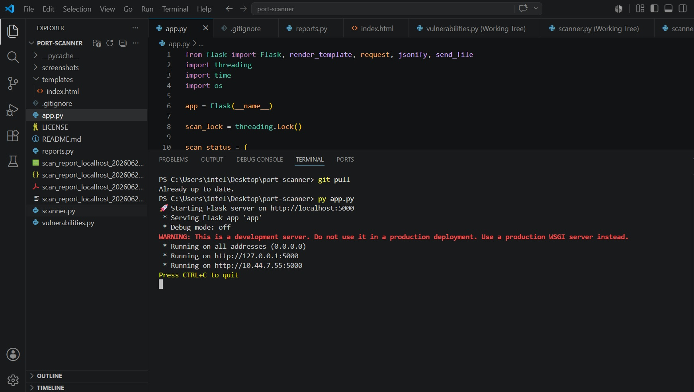

*The main dashboard interface with the Flask server starting up in the terminal. Shows the application running on `http://localhost:5000` with debug mode disabled, ready to accept scan requests.*

---

### Dashboard – Ready to Scan

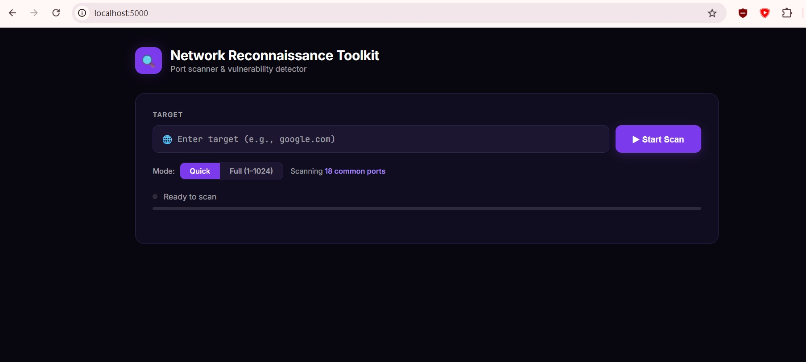

*The main dashboard with target input, scan mode toggle, and status indicators.*

---

### Dashboard – Quick Scan Results

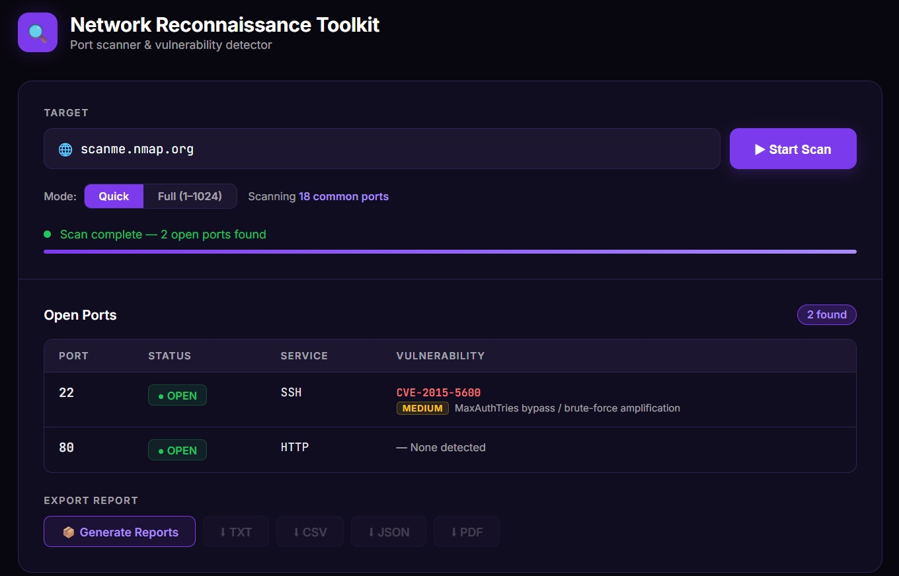

*Quick scan results showing open ports, services, banners, and detected vulnerabilities.*

---

### Dashboard – Full Scan Results

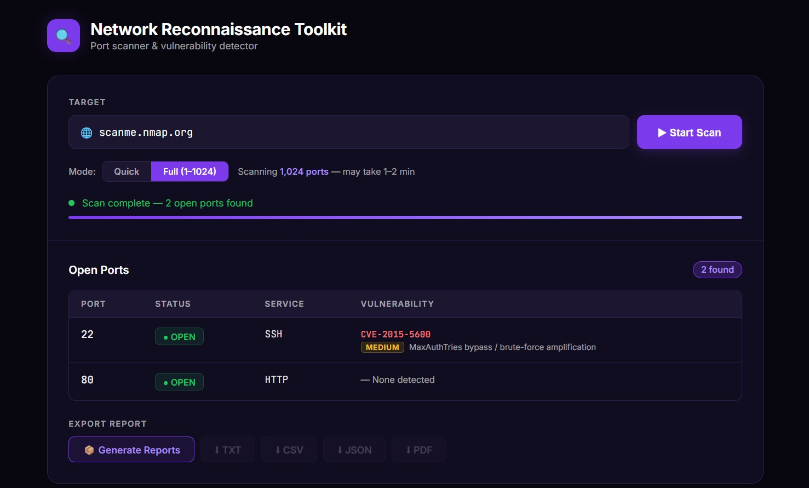

*Full scan (1-1024) results showing all open ports and vulnerabilities.*

---

### Reports Ready

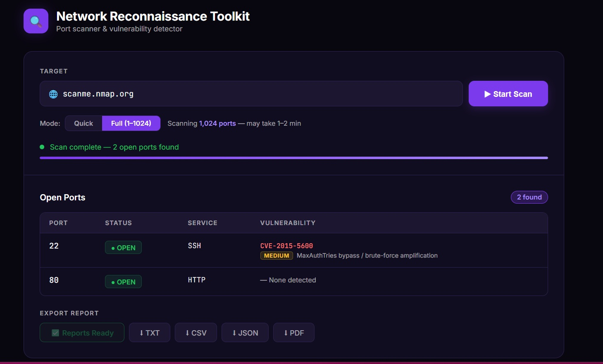

*Reports generated and ready for download (TXT, CSV, JSON, PDF).*

---

### PDF Report

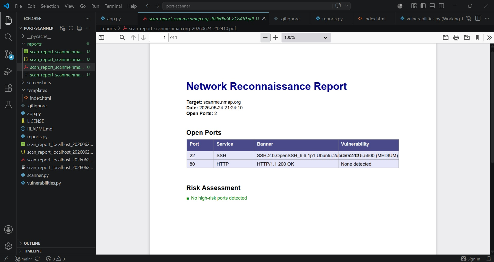

*Professional PDF report with port details, service banners, and vulnerability assessment.*

---

### CSV Report

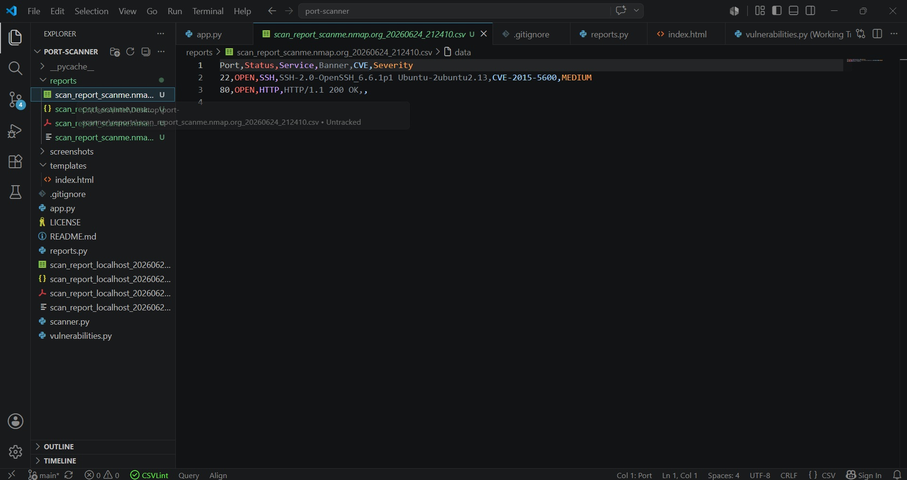

*CSV report opened in a spreadsheet application. Shows organized data with columns for Port, Status, Service, Banner, CVE, and Severity. Ideal for data analysis, filtering, and further processing in Excel or similar tools.*

---

### TXT Report

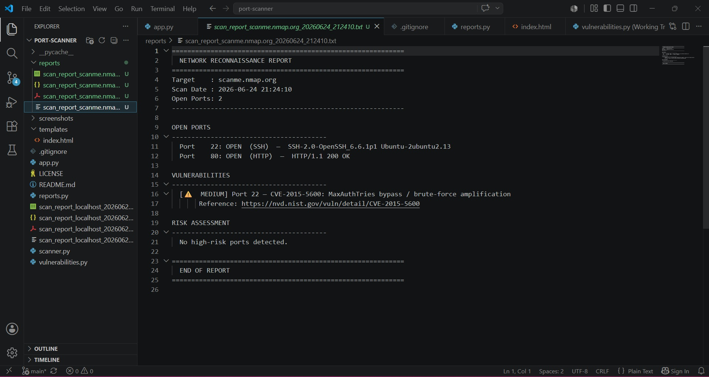

*Plain text report showing a clean, human-readable format. Includes target information, scan date, open ports with services, detected vulnerabilities with CVE details and severity levels, and a risk assessment summary.*

---

### JSON Report

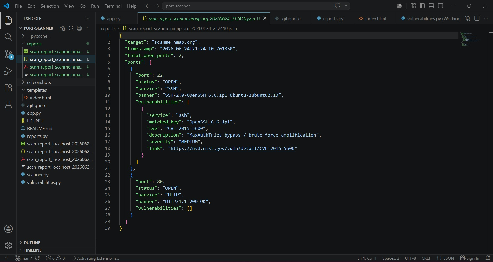

*JSON report structure showing vulnerability data including CVE, description, and severity.*

---

### Terminal Output

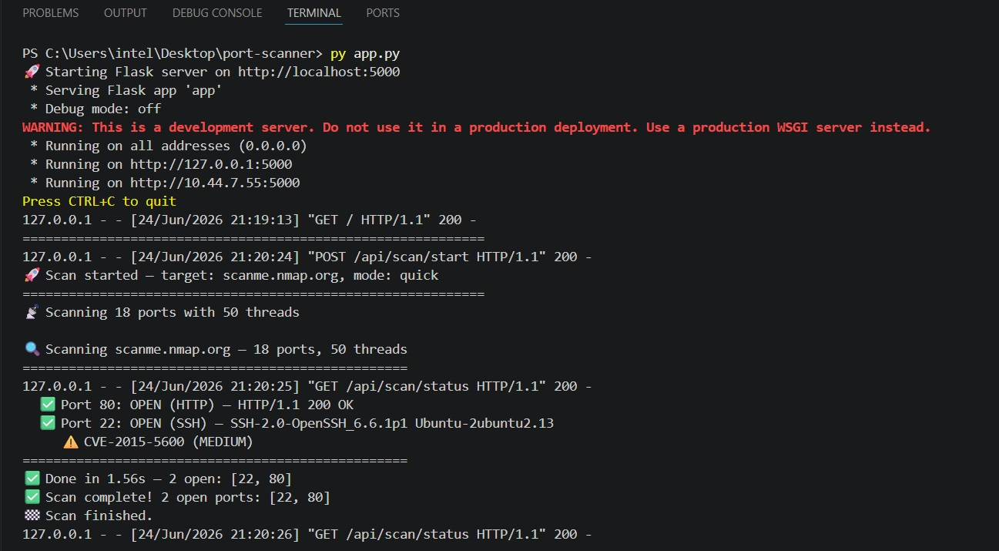

*Terminal output showing scan progress, open ports, and vulnerability detection.*

---

### CLI Scanner - Quick Mode

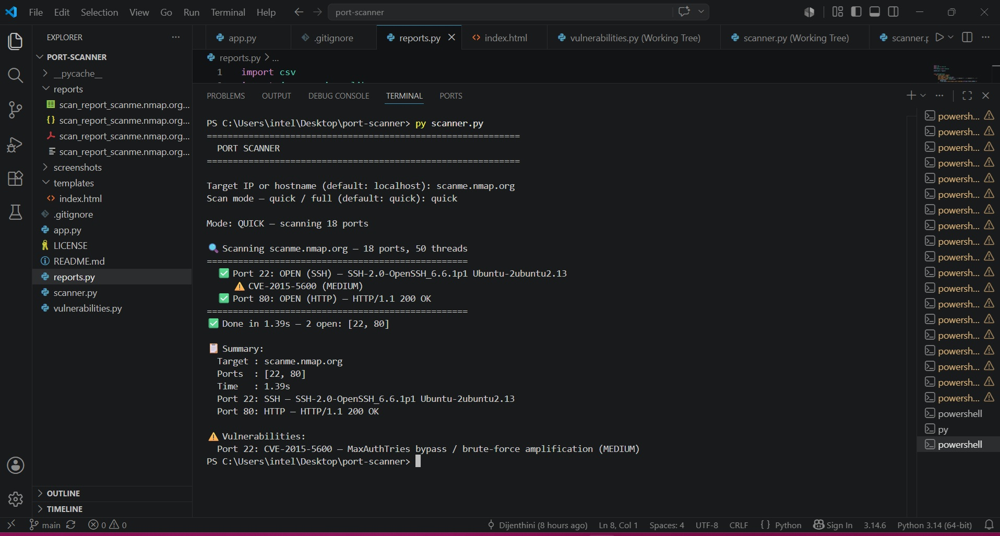

*Command-line scanner running in Quick mode, scanning 18 common ports. Shows real-time output of open ports, service banners, and detected CVEs (CVE-2015-5600) with severity level (MEDIUM).*

---

### CLI Scanner – Full Mode

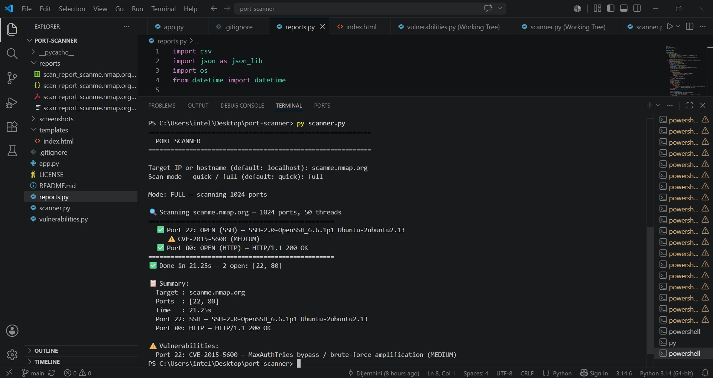

*Command-line scanner running in Full mode, scanning all 1,024 well-known ports. Demonstrates multi-threaded scanning performance and comprehensive port detection across the full port range.*

---

## 🎥 Demo Video

[🎬 Watch the demo video here](https://github.com/Dijenthini/port-scanner/releases/download/v1.0/Demo.mp4)

*Quick walkthrough of the toolkit in action — scanning, vulnerability detection, and report generation.*

---

## 🔍 How It Works
 
```
User clicks Scan
      │
      ▼
Flask /api/scan/start  ──►  Background thread starts
      │
      ▼
scanner.py
  ├── scan_port()        TCP connect to each port (threaded)
  ├── grab_banner()      Read service banner from open ports
  └── parse_banner()     Match banner against CVE database
      │
      ▼
Frontend polls /api/scan/status every 1s
  └── Updates progress bar + table in real time
      │
      ▼
/api/scan/report  ──►  reports.py generates TXT, CSV, JSON, PDF
/api/scan/download/<type>  ──►  Flask send_file() delivers to browser
```
 
---

## 📋 Supported Services

The scanner recognises **60+ services** including:

| Category | Services |
|----------|----------|
| **Web Servers** | HTTP, HTTPS, Apache, nginx, HTTP-Alt |
| **Remote Access** | SSH, Telnet, RDP, VNC |
| **File Transfer** | FTP, FTPS, SMB, NFS |
| **Email** | SMTP, POP3, IMAP, SMTPS |
| **Databases** | MySQL, PostgreSQL, MongoDB, Redis, Elasticsearch |
| **DevOps** | Docker, Kubernetes, Jenkins |
| **Networking** | DNS, DHCP, SNMP, LDAP |
| **Other** | Git, Memcached, SOCKS, OpenVPN, and more! |
 
---

## ⚠️ Known CVEs Detected
 
| Service | CVE | Severity |
|---|---|---|
| OpenSSH 6.6.1 | CVE-2015-5600 | MEDIUM |
| OpenSSH 7.2 | CVE-2016-6210 | MEDIUM |
| OpenSSH 8.5 | CVE-2021-41617 | HIGH |
| OpenSSH 9.3 | CVE-2023-38408 | CRITICAL |
| Apache 2.4.49 | CVE-2021-41773 | CRITICAL |
| Apache 2.4.50 | CVE-2021-42013 | CRITICAL |
| nginx 1.18/1.20 | CVE-2021-23017 | HIGH |
| MySQL 5.7 | CVE-2016-6662 | CRITICAL |
| RDP (BlueKeep) | CVE-2019-0708 | CRITICAL |
 
---

## ⚠️ Legal Disclaimer

**Educational purposes only.** This tool is designed for:

- ✅ Scanning your own systems
- ✅ Scanning systems you have explicit permission to test
- ✅ Learning about network security

**Do NOT scan:**

- ❌ Systems you don't own
- ❌ Systems without written permission
- ❌ Public networks without authorization

---

## 📝 License

This project is licensed under the **MIT License** – see the [LICENSE](LICENSE) file for details.

**Disclaimer:** This tool is for educational and authorized testing purposes only. The authors are not responsible for any misuse or damage caused by this software.

---

## 👥 Team

| Role | Name | GitHub |
|------|------|--------|
| **Dashboard & Reports** | Dijenthini | [@Dijenthini](https://github.com/Dijenthini) |
| **Scanner Engine & Vulnerability** | niduwara-j | [@niduwara-j](https://github.com/niduwara-j) |

---

## 🙏 Acknowledgments

- [Nmap](https://nmap.org/) – for inspiration
- [Flask](https://flask.palletsprojects.com/) – for the web framework
- [ReportLab](https://www.reportlab.com/) – for PDF generation

---

## ⭐ Show Your Support

Give this project a star ⭐ on GitHub!

---

## 📧 Contact

- GitHub: [@Dijenthini](https://github.com/Dijenthini) , [@niduwara-j](https://github.com/niduwara-j)
- LinkedIn: [Dijenthini Mariya Xavier](https://www.linkedin.com/in/dijenthini-mariya-xavier-a70a21368) , [Niduwara Jayasiri
](https://www.linkedin.com/in/niduwara-jayasiri-2169a33ab/)

---

💜 Built with Python, Flask, and a passion for cybersecurity.

*Stay curious. Stay ethical. Happy scanning!* 🔍
